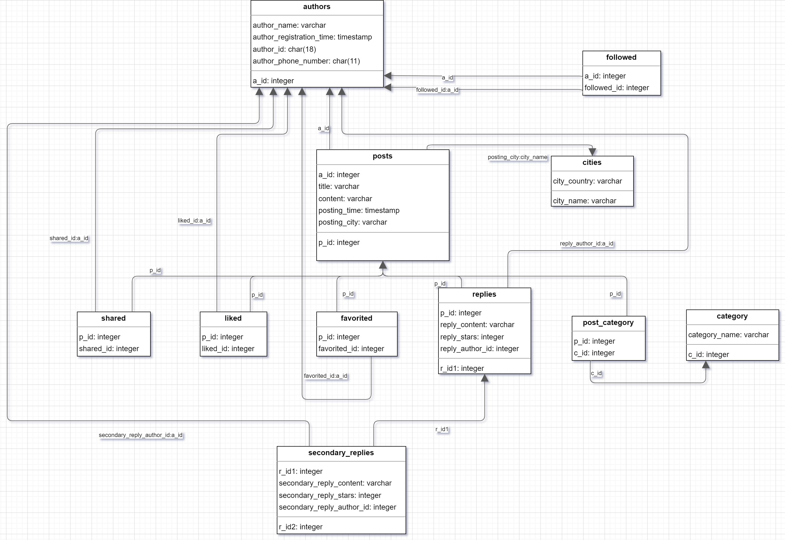

## SUSTech_CS307-DB_2023s_Project1

#### 小组成员：徐春晖 12110304，郭健阳 12111506

> 源码托管于 GitHub，将在项目 ddl 结束后基于 **MIT License** 协议开源，访问链接：
>
> https://github.com/OctCarp/SUSTech_CS307-DB_2023s_Projects

------

### 成员分工及贡献百分比 (平均分配)

徐春晖：

- Java 数据导入框架与编写

- Java 数据导入比较测试
- 项目相关的 SQL 语句编写
- 项目报告写作

郭健阳：

- Python 数据导入框架与编写
- 项目建表 SQL 语句框架与编写
- 项目 ER 图的绘制
- 项目报告写作

贡献百分比**相同，均为 50%**。

### 项目源码文件夹结构：

```shell
├─lib
├─resource
├─src_java
│  ├─models
│  ├─myutils
│  └─testload
├─src_py
└─src_sql
```

- [lib](../../Project1_Code/lib/) : Java 运行所需的 `.jar` 包
- [resource](../../Project1_Code/resource/) : 项目原始数据 `.json` 文件及配置文件
- [src_java](../../Project1_Code/src_java) : Java 源码文件夹
  - [models](../../Project1_Code/src_java/models) : [`Post.java`](../../Project1_Code/src_java/models/Post.java),  [`Reply.java`](../../Project1_Code/src_java/models/Reply.java) 数据类包
  - [myutils](../../Project1_Code/src_java/myutils) : 静态工具与数据类包
  - [testload](../../Project1_Code/src_java/testload) : 测试不同方式的 loader 所需要的类包
- [src_py](../../Project1_Code/src_py) : Python 源码文件夹
- [src_sql](../../Project1_Code/src_sql) : 项目运行需要的 DDL、DML 的语句文件

### 项目注意事项：

- 项目所用的 DBSM 为 [`PostgreSQL 15.2`](https://www.postgresql.org/)，运行前请先创建超级用户、用户名 `checker` 密码 `123456`，数据库 `CS307_Project_J`、`CS307_Project_P`、`CS307_Project_Test`，分别用于 Java 、Python、测试的数据库连接
- 本项目的 Python 导入脚本源文件为 [`src_py/Main.py`](../../Project1_Code/src_py/Main.py)， Java 为 [`src_java/Main.java`](../../Project1_Code/src_java/Main.java) 
- 开发与测试的操作系统为 Windows 10 Home 22H2，Java `JDK 17.0.3`，Python 版本为 `3.10.11`
- 为了方便读取，我们修改了 `.json` 文件个别信息字段的表述方式：使用 `_`代替空格，删除了 `'s`，改变表述方式，如： 
  - `"Post ID"` → `"Post_ID"`
  - `"Author's ID"` → `"Author_ID"`
  - `"Authors Who Favorited the Post"` → `"Author_Favorited"`

- 使用 IDE 时，请将 [`Project1_Code/`](../../Project1_Code/) 文件夹以项目打开，把 [`lib/`](../../Project1_Code/lib/) 文件夹作为库导入，项目中导入程序使用的路径均为**相对路径**，若出现路径报错，请用户修改以下文件的中的路径字段：

  - [`src_py/Main.py`](../../Project1_Code/src_py/Main.py)
  - [`src_java/myutils/Info.java`](../../Project1_Code/src_java/myutils/Info.java), [`src_java/testload/TestInfo.java`](../../Project1_Code/src_java/testload/TestInfo.java)
  - [`resource/paths.properties`](../../Project1_Code/paths.properties), [`resource/test_paths.properties`](../../Project1_Code/resource/test_paths.properties)


------

### Task 1: E-R Diagram

本小组使用 [drawio](https://www.diagrams.net/) 绘图工具，绘制本项目的 E-R 图，截图如下：


------

### Task 2: Relational Database Design

本项目使用 [`createtable.sql`](../../Project1_Code/src_sql/createtable.sql) 文件创建数据表，使用 `PostgreSQL` `DDL` 语法编写。

#### 数据库设计

使用 [`DataGrip`](https://www.jetbrains.com/datagrip/) 创建数据表并全选后通过右键 `Diagram > Show Visualization` 显示如下数据表设计及关系。并通过导入 `drawio` 调整后再导出为 `.png` 文件。 




#### 设计思路及说明

##### 数据表及其各列含义说明

在整个项目中共创建了 11 个数据表，数据表和其中各列、外键的含义如下：

- `authors` 存储作者信息，包括为每位作者的编号 `a_id` （主键）、作者的名字 `author_name` 、作者注册的时间 `author_registration_time` 、作者的 18 位身份 ID `author_id`、作者的 11 位手机号码 `author_phone_number`
- `posts` 存储帖子信息，包括帖子的 ID `p_id` （主键）、发帖作者的 ID `a_id` （外键，来自 `authors` 中的 `a_id` ）、帖子的标题 `title` 、帖子的内容 `content` 、帖子的发表时间 `posting_time` 、帖子发表的城市 `posting_city` （外键，来自 `cities` 中的 `city_name` ）
- `cities` 存储城市以及所在的国家信息，包括城市名 `city_name` （主键）、城市对应的国家名 `country_name` 
- `category` 存储类别名信息，包括每个类别的编号 `c_id` （主键）、类别的名字 `category_name` 
- `post_category` 存储帖子 ID  `p_id` （外键，来自 `posts` 中的 `p_id` ）和对应的类别编号 `c_id` （外键，来自 `category` 中的 `c_id` ），同时 `p_id` 和 `c_id` 联合作为主键
- `followed` 存储作者 ID `a_id` （外键，来自 `authors` 中的 `a_id` ）每位作者关注的人的 ID `followed_id` （外键，来自 `authors` 中的 `a_id` ），同时  `a_id` 和 `followed_id` 联合作为主键
- `favorited` 存储每个帖子 ID `p_id` （外键，来自 `posts` 中的 `p_id` ）和收藏该帖子的人的 ID `favorited_id` （外键，来自 `authors` 中的 `a_id` ），同时  `p_id` 和 `favorited_id` 联合作为主键
- `shared` 存储每个帖子 ID `p_id` （外键，来自 `posts` 中的 `p_id` ）和分享该帖子的人的 ID `shared_id` （外键，来自 `authors` 中的 `a_id` ），同时  `p_id` 和 `shared_id` 联合作为主键
- `liked` 存储每个帖子 ID `p_id` （外键，来自 `posts` 中的 `p_id` ）和点赞该帖子的人的 ID `liked_id` （外键，来自 `authors` 中的 `a_id` ），同时  `p_id` 和 `liked_id` 联合作为主键
- `replies` 存储每个帖子对应的一级回复，包括一级回复的编号 `r_id1` （主键）、帖子的 ID `p_id` （外键，来自 `posts` 中的 `p_id` ）、一级回复的内容 `reply_content` 、一级回复的星数 `reply_stars` 、一级回复的作者编号 `reply_author_id` 
- `secondary_replies` 存储每个一级回复对应的二级回复，包括二级回复的编号 `r_id2` （主键）、一级回复的编号 `r_id1` （外键，来自 `replies` 中的 `r_id1` ）、二级回复的内容 `secondary_reply_content` 、二级回复的星数 `secondary_reply_stars` 、二级回复的作者编号 `secondary_reply_author_id` 

##### 数据库构建的合理性

- 满足三大范式

  通过示意图可以看到，每个数据表的每一列都是不可分割的，仅有一个值。每个数据表都有主关键字，且主关键字都是 `UNIQUE` 的，其它数据元素能和主关键字一一对应。通过设计外键连接，我们将同一数据表中具有“传递”关系的数据列设计成不同的表格进行设计，不存在非关键字段对任一候选关键字段的传递函数依赖。可见，按以上设计思想设计的数据库满足三大范式的要求。

- 满足项目要求 [文档](../Project1_Requirements/CS307-spring23-project1.pdf) 所要求的其它详细注意点。

------

### Task 3: Data Import

#### Task 3.1 Basic Requirements

项目实现了自动执行对旧表 `DROP IF EXISTS` 并 `CREATE` 新表的语句，只需配置好路径直接运行 `main` 函数即可，其中 Java 的 `main` 方法结构为：

```java
public static void main(String[] args) {
    Info.infoInit();

    normalImport(); //run normal importer
//    testLoader(); //run test loader
}
```

由于二者的导入逻辑大体相似，以下便以 Java 为例：

1. 信息初始化，将 `.json` 文件分别读取为 `Post`、`Reply` 类的集合 `posts`、`replies`，连接数据库，读取和执行必要的 DDL 初始化语句 

2. 分别创建作者姓名、作者 ID、手机号、帖子类别、发帖城市的 5 个 `ArrayList`，用于**导入软件层面的去重**（即：先检查数据是否在集合中，对于不在集合中的数据再执行 `INSERT`，并加入 `ArrayList`，下文相关“插入”操作前皆含有此步骤，不再赘述）

3. 遍历 `posts`，对每一个 `Post` 对象：
   1. 根据作者姓名在 `ArrayList` 中的索引生成 integer 类型的 `a_id`，结合作者相关原始数据，执行 `authors` 表的插入 （第一次遍历完成后，所有有完整信息的作者完成插入，之后第一次出现的作者若没有完整信息，将生成 `a_id`，并随机生成注册时间、18 位 ID、11 位手机号并插入 `author` 表，不再赘述）
   2. 对于发帖城市执行与 1 相似的操作，将 `city_name` 结合 `city_country` 原始数据 ，执行 `cities` 表的插入
   3. 至此完成 `posts` 表的外键信息插入，将 `a_id`，`city_name` 结合帖子相关原始数据，执行 `posts` 表的插入
   4. 对于发帖类型执行与 1 相似的操作，对每个类别生成 `c_id`，结合 `category_name` 原始数据，执行 `category` 表的插入
   5. 至此完成 `post_category` 表的外键信息插入，将帖子 ID `p_id` 结合类别 ID `c_id`，执行 `post_category` 表的插入

4. 再次遍历 `posts`，对每一个 `Post` 对象：
   1. 根据作者关注的原始信息，将帖子作者 ID `a_id` 结合作者关注者的 `a_id` ：`followed_id`，执行 `followed` 表的插入
   2. 根据帖子分享、点赞、收藏的原始信息，将帖子 ID `p_id` 结合互动者 ID `a_id` ，分别执行 `shared`、`liked`、`favorited` 表的插入

5. 遍历 `replies`，对每一个 `Reply` 对象：
   1. 若帖子 ID、一级回复内容、一级回复作者，这三者与上一条记录完全相同，则视为同一条一级回复，不进行额外操作；否则生成`r_id1` ，结合帖子 ID `p_id` 和一级回复的原始信息信息，执行 `replies` 表的插入
   2. 对每条记录生成一条二级回复，生成 `r_id2`，结合一级回复的 `r_id1` 和二级回复的原始信息， 执行 `secondary_replies` 表的插入

6. 至此所有 11 个表插入完成

#### Task 3.2 Advanced requirements

##### 算法方面：

- 使用集合查询使用 `indexOf` 方法而非 `contains` 方法，虽然代码可读性降低但是会节省一次查询操作（编译阶段也许会优化？）
- 只把 `replies` 记录中的当前回复与上条回复作比较来判断回复是否相同，虽然存在冗余可能性，但是维持了较高效率

##### 数据库操作方面：

**测试环境（软件已在开头注意事项列出）：**

| Hardware | XU                                               | GUO                                                      |
| -------- | ------------------------------------------------ | -------------------------------------------------------- |
| CPU      | AMD Ryzen 7 5800H with Radeon Graphics  3.20 GHz | 11th Gen Intel(R) Core(TM) i7-11800H @ 2.30GHz  2.30 GHz |
| RAM      | 2 × 8GB DDR4 3200 MHZ                            | 2 × 8GB DDR4 3200 MHZ                                    |
| Disk     | Samsung SSD 980 1TB                              | Lexar 1TB SSD                                            |


由下文可看出 Intel 在响应速度上较有优势，AMD 在批处理上更占优

**不同 loader 的比较：**

测试源码文件夹 [`src_java/testload`](../../Project1_Code/src_java/testload)，其中 [`TestImplement.java`](../../Project1_Code/src_java/testload/TestImplement.java) 继承 [`AbstractLoaders.java`](../../Project1_Code/src_java/testload/AbstractLoaders.java) 并实现了 `Awful`、`Connect`、`Prepare`、`Transaction`、`Batch` 5 个 Loader 类， 分别对应 Lab 10 中的 5 种 Loader 方式

为了方便比较，选用了数据量最多的 `authors` 表作为比较，一共输入 9157 条数据，测试数据标准输出格式如下：

```java
void printMessage(long speed) {
    System.out.printf("%s:\n%d records successfully loaded\n", this, cnt);
    System.out.printf("Loading speed : %d records/s\n\n", speed);
}
```

标准输出信息图片示例：


导入速度输出如下（单位：条/秒，测试 3 次，取平均值）：

| Loader          | XU   |      |      | Avg      |         | GUO  |      |      | Avg      |         |
| --------------- | ---- | ---- | ---- | -------- | ------- | ---- | ---- | ---- | -------- | ------- |
| **Awful**       | 17   | 22   | 21   | **20**   |         | 15   | 15   | 15   | **15**   |         |
| **Connect**     | 3124 | 3241 | 3129 | **3165** | +15725% | 3368 | 3633 | 3586 | **3529** | +23426% |
| **Prepare**     | 3359 | 3748 | 3643 | **3583** | +13.2%  | 4122 | 4084 | 4058 | **4088** | +15.8%  |
| **Transaction** | 5112 | 5759 | 5780 | **5550** | +54.9%  | 6241 | 6170 | 6237 | **6216** | +52.1%  |
| **Batch**       | 8534 | 9558 | 9942 | **9345** | +68.3%  | 9496 | 9479 | 8847 | **9274** | +49.1%  |

柱状图为：


**由上表可以看出：**

- 对每条语句创建新的数据库的连接，效率低到难以忍受
- 仅仅使用 `PrepareStatement` 替代格式化字符串的 `Statement`，提升不是非常明显，考虑到可能已经存在编译器层面的优化，使 `autoCommit` 成为短板
- 关闭 `autoCommit` 后使用 `PrepareStatement`，效率提升明显
- 批量执行 `PrepareStatement`，效率提升明显（经过测试，当每批大小低于 10 时，效率将会开始出现明显下降，`Batch` 向 `Transaction` 靠拢）

**在实际的完整导入操作中**，还使用了 `disable triggers` 再 `enable triggers` 的方法，10 次测试平均耗时如下（单位：秒）：

| Importer                    | XU    |      | GUO   |      |
| --------------------------- | ----- | ---- | ----- | ---- |
| **Python**                  | 6.083 |      | 5.031 |      |
| **Python Disable Triggers** | 5.418 | +12% | 4.631 | +8%  |
| **Java**                    | 2.123 |      | 2.329 |      |
| **Java Disable Triggers**   | 1.679 | +26% | 1.897 | +20% |

**由上表可以看出：**

- 经过测试，关闭数据库触发器检查，在相对最快的基础上仍有明显的绝对时间减少；**但是此方法需要保证在导入软件层面对插入的数据进行约束，是不够安全的行为**
- Python 导入则比 Java 慢，但是考虑到脚本语言的特性，写起来实在方便很多

------

### Misc

#### 思考与可能存在的优化：

- 为唯一的用户名生成唯一的的用户 ID 与手机号码使用了 `Arraylist`，以及所有相关的生成 ID 的操作都要顺序执行，线程不安全，能否存在其他解决方案使实现数据库多线程操作？
- 若要实现不同 DBMS（如 `MySQL`）之间的插入效率比较，除了驱动和链接改变外，关闭触发器等的 `DDL` 方言也要做出改变
- 使用 `HashMap` 来对应各种 ID 与名称？结合 `Project2` 的要求可以进行相关的建表和导入修改 

------

### 项目报告到此结束，感谢您的阅读！

