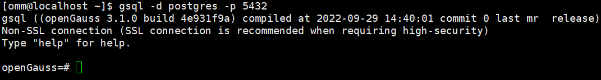
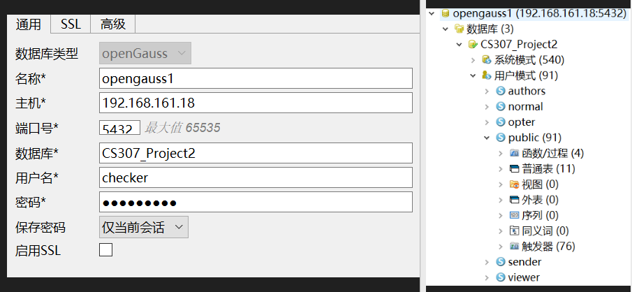

## SUSTech_CS307-DB_2023s_Project2

#### 小组成员：徐春晖 12110304，郭健阳 12111506

> 源码托管于 GitHub，将在项目 ddl 结束后基于 **MIT License** 协议开源，访问链接：
>
> https://github.com/OctCarp/SUSTech_CS307-DB_2023s_Projects

------

### 项目与小组基础信息

#### 成员分工及贡献百分比 (平均分配)

徐春晖：

- 框架测试与使用
- 表结构修改与导入设计
- 基础功能实现
- openGauss 搭建
- 项目报告写作

郭健阳：

- 高级功能实现
- 前端功能完善
- 项目报告写作

贡献百分比**相同，均为 50%**。

#### 项目源码文件夹结构：

```shell
├─Backend
│  ├─lib
│  ├─resource
│  │  └─sql
│  └─src
│      ├─backend
│      ├─instance
│      ├─loader
│      │  ├─models
│      │  └─myutils
│      └─model
├─docs
└─Frontend
```

Backend 解释:

- [lib](../Backend/lib/) : Java 运行所需的 `.jar` 包
- [resource](../Backend/resource/) : 项目原始数据 `.json` 文件及配置文件
  - [sql](../Backend/resource/sql) : 项目运行需要用到的一些静态 SQL 语句
- [src](../Backend/src) : Java 源码文件夹
  - [backend](../Backend/src/backend) : 后端主程序包
  - [instance](../Backend/src/instance) : 后端运行实例包
  - [loader](../Backend/src/loader) : 数据导入需要用到的 `.java` 文件包
    - [models](../Backend/src/loader/models) : 仅在导入原始数据包时需要用到的数据模型
    - [myutils](../Backend/src/loader/myutils) : 仅在导入原始数据包时需要用到的工具类
  - [model](../Backend/src/model) : `.json` 传递的数据模型

### 基础 API

因为我们 API 的实现套用了许多相似的格式，为简便展示起见，我们决定不绘制表格。而是将接口方法的和代码与注释结合，阐释功能和参数。

#### 用户注册 & 登录

```java
//查找ID是否存在方法
public static String ck_identity(Request request, Response response) {
    String identity = request.queryParams("identity");
    //以identity为参数
    
    //返回是否有此identity的判断
    return String.valueOf(getUserManagerInstance().hasIdentity(identity)); 
}

//注册主方法
public static String regMain(Request request, Response response) {
    String name = request.queryParams("name");
    String identity = request.queryParams("identity");
    String passwd = request.queryParams("passwd");
    String phone = request.queryParams("phone");
    //以用户信息为参数
    
    //返回是否成功注册的判断
    return String.valueOf(getUserManagerInstance().reg(name, identity, passwd, phone));
}

//登录主方法
public static String checkLogin(Request request, Response response) {
    String identity = request.headers("identity");
    String passwd = request.headers("passwd");
    //以identity和password为参数
    
    //返回是否成功登录的判断
    return String.valueOf(getUserManagerInstance().ckLogin(identity, passwd));
}
```

#### 点赞、收藏、转发

```java
//帖子操作主方法
public static String doPostOpt(Request request, Response response) {
    int p_id = Integer.parseInt(request.headers("p_id"));
    int a_id = Integer.parseInt(request.headers("a_id"));
    String type = request.headers("type");
    //以目标帖子ID，操作用户ID，操作类型为参数
    
    boolean res;
    res = switch (type) {
        case "liked" -> getOptInstance().doLiked(p_id, a_id);
        case "shared" -> getOptInstance().doShared(p_id, a_id);
        case "favorited" -> getOptInstance().doFavorited(p_id, a_id);W
        default -> throw new IllegalStateException("Unexpected value: " + type);
    };
    //返回是否成功操作的判断
    return String.valueOf(res);
}
```

#### 个人列表显示（包括所有与作者个人相关的列表）

```java
//显示与个人列表相关内容的主方法
public static String getAuthorOpts(Request request, Response response) {
    int a_id = Integer.parseInt(request.headers("a_id"));
    String type = request.headers("type");
    //以操作者ID，操作类型为参数
	
    //返回用Gson打包的.json数组，每个对象由其对应的数据模型组成
    return switch (type) {
        case "info" -> new Gson().toJson(getNormalInstance().getAuthorInfo(a_id));
        case "post" -> new Gson().toJson(getNormalInstance().getMyPosts(a_id));
        case "reply" -> new Gson().toJson(getNormalInstance().getMyReply(a_id));
        case "reply2" -> new Gson().toJson(getNormalInstance().getMyReply2(a_id));
        case "liked" -> new Gson().toJson(getNormalInstance().getLiked(a_id));
        case "shared" -> new Gson().toJson(getNormalInstance().getShared(a_id));
        case "favorited" -> new Gson().toJson(getNormalInstance().getFavorited(a_id));
        case "follow" -> new Gson().toJson(getNormalInstance().getFollowed(a_id));
        case "block" -> new Gson().toJson(getNormalInstance().getBlocked(a_id));
        default -> throw new IllegalStateException("Unexpected value: " + type);
    };
}
```

#### 用户对用户的操作（关注、拉黑）

此部分我们首先判断操作是否已经执行，再决定执行新操作还是取消旧操作。

我们在点赞、收藏、转发的部分也实现了先判断、再决定执行新操作还是取消旧操作的方法，思路相似，不再赘述。

```java
//判断操作是否已经做过的方法
public static String ckAuthorOpt(Request request, Response response) {
    int a_id = Integer.parseInt(request.headers("a_id"));
    int a_id2 = Integer.parseInt(request.headers("a_id2"));
    String type = request.headers("type");
    //参数为操作用户,对象用户ID，以及操作类型
    
    boolean res;
    res = switch (type) {
        case "follow" -> getOptInstance().hasFollowed(a_id, a_id2);
        case "block" -> getOptInstance().hasBlocked(a_id, a_id2);
        default -> throw new IllegalStateException("Unexpected value: " + type);
    };
    //返回是否已经做过
    return String.valueOf(res);
}

//进行操作的方法
public static String doAuthorOpt(Request request, Response response) {
    int a_id = Integer.parseInt(request.headers("a_id"));
    int a_id2 = Integer.parseInt(request.headers("a_id2"));
    String type = request.headers("type");
    //参数为操作用户,对象用户ID，以及操作类型
    
    boolean res;
    res = switch (type) {
        case "follow" -> getOptInstance().doFollow(a_id, a_id2);
        case "block" -> getOptInstance().doBlock(a_id, a_id2);
        default -> throw new IllegalStateException("Unexpected value: " + type);
    };
    //返回是否成功
    return String.valueOf(res);
}

//取消操作的方法
public static String undoAuthorOpt(Request request, Response response) {
    int a_id = Integer.parseInt(request.headers("a_id"));
    int a_id2 = Integer.parseInt(request.headers("a_id2"));
    String type = request.headers("type");
    //参数为操作用户,对象用户ID，以及操作类型
    
    boolean res;
    res = switch (type) {
        case "follow" -> getOptInstance().unFollow(a_id, a_id2);
        case "block" -> getOptInstance().unBlock(a_id, a_id2);
        default -> throw new IllegalStateException("Unexpected value: " + type);
    };
    //返回是否成功
    return String.valueOf(res);
}
```

#### 用户发布帖子

```java
//发布帖子方法
public static String sendPost(Request request, Response response) {
    int a_id = Integer.parseInt(request.headers("a_id"));
    String title = request.headers("title");
    String content = request.headers("content");
    String city = request.headers("city");
    String[] cates = new Gson().fromJson(request.headers("cate"), String[].class);
    //参数为发帖者ID，标题，内容，发帖城市，发帖类型，发帖时间后端自动生成
    
    //返回值为是否成功发帖
    return String.valueOf(getSendInstance().sendPost(a_id, title, content, city, cates));
}
```

#### 用户回复

```java
//回复帖子方法
public static String sendReply(Request request, Response response) {
    int a_id = Integer.parseInt(request.headers("a_id"));
    int p_id = Integer.parseInt(request.headers("p_id"));
    String content = request.headers("content");
    //参数为回复者ID，回复的帖子的ID，回复内容
    
    //返回值为是否成功回复
    return String.valueOf(getSendInstance().sendReply(p_id, a_id, content));
}
```

#### 二级回复

```java
//二级回复方法
public static String sendReply2(Request request, Response response) {
    int a_id = Integer.parseInt(request.headers("a_id"));
    int r_id1 = Integer.parseInt(request.headers("r_id1"));
    String content = request.headers("content");
    //参数为二级回复者ID，一级回复ID，二级回复内容
    
    //返回值为是否成功二级回复
    return String.valueOf(getSendInstance().sendSubReply(r_id1, a_id, content));
}
```

### 高级功能

#### openGauss

本项目完全实现了基于 [openGauss](https://www.opengauss.org/) 的数据库操作，已在答辩中展示。

配置细节不再赘述，在 Windows 环境下打开 openEuler 虚拟机，可以登录数据库：



或者使用 Data Studio 软件进行数据库可视化管理，数据和表已经完全导入，如右图所示：



接下来在后端导入 `opengauss-jdbc-5.0.0.jar`。在连接管理类中加载驱动，设置连接的地址为：

```java
    private static final String baseUrl = 
        "jdbc:opengauss://192.168.161.18:5432/CS307_Project2";
```

即可基于 openGauss 数据库实现功能。

#### 更多 API 设计


#### 封装后端服务器，基于 HTTP 通信

功能可用性已经在答辩中体现

我们在本项目中使用了 Spark Core，但只使用了内部封装的简单的通信功能

```java
package backend;

import instance.CountId;
import spark.Request;
import spark.Response;

import static spark.Spark.*;

public class BackendServer {
    //服务器入口主方法，一次启动，持续运行，等待连接
    public static void main(String[] args) {
        //初始化ID相关计数
        CountId.init();
        
        //服务端口
        port(22307);
        
        //映射对应的接口方法
        post("/reg/ck_id", UserHandler::ck_identity);
        post("/reg/regi", UserHandler::regMain);
        post("/login", UserHandler::checkLogin);
        
        //.......
        
        //以.json格式在HTTP上传递数据
        after((Request request, Response response) -> {
            response.header("Content-Type", "application/json");
        });
    }
}
```

#### 数据库连接池

在框架下本项目简单实现了数据库连接池，用 `Connection Manager` 类做管理，API 方法分析数据，并调用对应的连接进行数据库操作。并对池子中的不连接赋予不同的权限，将在权限实现处详细说明

```java
    private static Connection viewConn, normalConn, optConn,
            senderConn, authorsConn, rootConn;
```

#### 页面显示设计

因为项目成员没有系统接触过前端，决定使用 Python 标准输入输出做前端，朴实实用的命令行：


菜单和帖子显示示例：


#### 权限设计

结合连接管理，对不同的用户授予不同的权限，后端 API 方法分别使用对应的连接的 role 去实现功能，以下是一些示例：

```sql
CREATE USER viewer WITH PASSWORD 'viewer@123';
CREATE USER normal WITH PASSWORD 'normal@123';
CREATE USER opter WITH PASSWORD 'opter@123';
CREATE USER sender WITH PASSWORD 'sender@123';
CREATE USER authors WITH PASSWORD 'authors@123';
--热度表函数/过程的执行权限
GRANT SELECT, UPDATE, INSERT, DELETE, TRIGGER ON TABLE post_views TO viewer, normal, opter, sender, authors;
GRANT EXECUTE ON FUNCTION delete_view_count_fsl(), update_view_count_fsl() TO opter;
GRANT EXECUTE ON FUNCTION update_view_count_byreply(), update_view_count_bysubreply() TO sender;
--有浏览权限的viewer
GRANT SELECT ON TABLE authors, posts, p_cate,posts, replies, sub_replies, blocked TO viewer;
--有查找个人列表权限的normal
GRANT SELECT ON TABLE authors,posts,replies, sub_replies,
    shared, favorited, followed, blocked, liked TO normal;
--有帖子、用户操作权限的opter
GRANT SELECT, DELETE, INSERT ON TABLE shared, favorited, followed, blocked, liked TO opter;
--有发帖权限的sender
GRANT SELECT, INSERT ON TABLE posts, p_cate,replies, sub_replies, post_views TO sender;
--有管理用户权限的authors
GRANT SELECT, INSERT ON TABLE authors TO authors;
```

------

### 项目报告到此结束，感谢您的阅读！