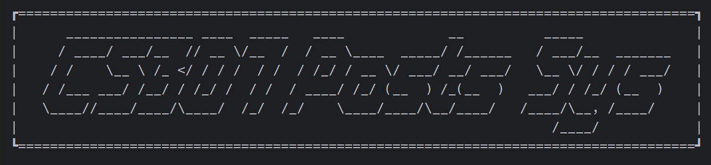

## SUSTech_CS307-DB_2023s_Project2

#### 小组成员：徐春晖 12110304，郭健阳 12111506

> 源码托管于 GitHub，将在项目 ddl 结束后基于 **MIT License** 协议开源，访问链接：
>
> https://github.com/OctCarp/SUSTech_CS307-DB_2023s_Projects

------

### 项目与小组基础信息

#### 成员分工及贡献百分比 (平均分配)

徐春晖：

- 框架测试与使用
- 表结构修改与导入设计
- 基础功能实现
- openGauss 搭建
- 项目报告写作

郭健阳：

- 高级功能实现
- 前端功能完善
- 项目报告写作

贡献百分比**相同，均为 50%**。

#### 项目源码文件夹结构：

```shell
├─Backend
│  ├─lib
│  ├─resource
│  │  └─sql
│  └─src
│      ├─backend
│      ├─instance
│      ├─loader
│      │  ├─models
│      │  └─myutils
│      └─model
├─docs
└─Frontend
```

Backend 解释:

- [lib](../Backend/lib/) : Java 运行所需的 `.jar` 包
- [resource](../Backend/resource/) : 项目原始数据 `.json` 文件及配置文件
  - [sql](../Backend/resource/sql) : 项目运行需要用到的一些静态 SQL 语句
- [src](../Backend/src) : Java 源码文件夹
  - [backend](../Backend/src/backend) : 后端主程序包
  - [instance](../Backend/src/instance) : 后端运行实例包
  - [loader](../Backend/src/loader) : 数据导入需要用到的 `.java` 文件包
    - [models](../Backend/src/loader/models) : 仅在导入原始数据包时需要用到的数据模型
    - [myutils](../Backend/src/loader/myutils) : 仅在导入原始数据包时需要用到的工具类
  - [model](../Backend/src/model) : `.json` 传递的数据模型

### 基础 API

因为我们 API 的实现套用了许多相似的格式，为简便展示起见，我们决定不绘制表格。而是将接口方法的和代码与注释结合，阐释功能和参数。

#### 用户注册 & 登录

```java
//查找ID是否存在方法
public static String ck_identity(Request request, Response response) {
    String identity = request.queryParams("identity");
    //以identity为参数
    
    //返回是否有此identity的判断
    return String.valueOf(getUserManagerInstance().hasIdentity(identity)); 
}

//注册主方法
public static String regMain(Request request, Response response) {
    String name = request.queryParams("name");
    String identity = request.queryParams("identity");
    String passwd = request.queryParams("passwd");
    String phone = request.queryParams("phone");
    //以用户信息为参数
    
    //返回是否成功注册的判断
    return String.valueOf(getUserManagerInstance().reg(name, identity, passwd, phone));
}

//登录主方法
public static String checkLogin(Request request, Response response) {
    String identity = request.headers("identity");
    String passwd = request.headers("passwd");
    //以identity和password为参数
    
    //返回是否成功登录的判断
    return String.valueOf(getUserManagerInstance().ckLogin(identity, passwd));
}
```

#### 点赞、收藏、转发

```java
//帖子操作主方法
public static String doPostOpt(Request request, Response response) {
    int p_id = Integer.parseInt(request.headers("p_id"));
    int a_id = Integer.parseInt(request.headers("a_id"));
    String type = request.headers("type");
    //以目标帖子ID，操作用户ID，操作类型为参数
    
    boolean res;
    res = switch (type) {
        case "liked" -> getOptInstance().doLiked(p_id, a_id);
        case "shared" -> getOptInstance().doShared(p_id, a_id);
        case "favorited" -> getOptInstance().doFavorited(p_id, a_id);W
        default -> throw new IllegalStateException("Unexpected value: " + type);
    };
    //返回是否成功操作的判断
    return String.valueOf(res);
}
```

#### 个人列表显示（包括所有与作者个人相关的列表）

```java
//显示与个人列表相关内容的主方法
public static String getAuthorOpts(Request request, Response response) {
    int a_id = Integer.parseInt(request.headers("a_id"));
    String type = request.headers("type");
    //以操作者ID，操作类型为参数
	
    //返回用Gson打包的.json数组，每个对象由其对应的数据模型组成
    return switch (type) {
        case "info" -> new Gson().toJson(getNormalInstance().getAuthorInfo(a_id));
        case "post" -> new Gson().toJson(getNormalInstance().getMyPosts(a_id));
        case "reply" -> new Gson().toJson(getNormalInstance().getMyReply(a_id));
        case "reply2" -> new Gson().toJson(getNormalInstance().getMyReply2(a_id));
        case "liked" -> new Gson().toJson(getNormalInstance().getLiked(a_id));
        case "shared" -> new Gson().toJson(getNormalInstance().getShared(a_id));
        case "favorited" -> new Gson().toJson(getNormalInstance().getFavorited(a_id));
        case "follow" -> new Gson().toJson(getNormalInstance().getFollowed(a_id));
        case "block" -> new Gson().toJson(getNormalInstance().getBlocked(a_id));
        default -> throw new IllegalStateException("Unexpected value: " + type);
    };
}
```

#### 用户对用户的操作（关注、拉黑）

此部分我们首先判断操作是否已经执行，再决定执行新操作还是取消旧操作。

我们在点赞、收藏、转发的部分也实现了先判断、再决定执行新操作还是取消旧操作的方法，思路相似，不再赘述。

```java
//判断操作是否已经做过的方法
public static String ckAuthorOpt(Request request, Response response) {
    int a_id = Integer.parseInt(request.headers("a_id"));
    int a_id2 = Integer.parseInt(request.headers("a_id2"));
    String type = request.headers("type");
    //参数为操作用户,对象用户ID，以及操作类型
    
    boolean res;
    res = switch (type) {
        case "follow" -> getOptInstance().hasFollowed(a_id, a_id2);
        case "block" -> getOptInstance().hasBlocked(a_id, a_id2);
        default -> throw new IllegalStateException("Unexpected value: " + type);
    };
    //返回是否已经做过
    return String.valueOf(res);
}

//进行操作的方法
public static String doAuthorOpt(Request request, Response response) {
    int a_id = Integer.parseInt(request.headers("a_id"));
    int a_id2 = Integer.parseInt(request.headers("a_id2"));
    String type = request.headers("type");
    //参数为操作用户,对象用户ID，以及操作类型
    
    boolean res;
    res = switch (type) {
        case "follow" -> getOptInstance().doFollow(a_id, a_id2);
        case "block" -> getOptInstance().doBlock(a_id, a_id2);
        default -> throw new IllegalStateException("Unexpected value: " + type);
    };
    //返回是否成功
    return String.valueOf(res);
}

//取消操作的方法
public static String undoAuthorOpt(Request request, Response response) {
    int a_id = Integer.parseInt(request.headers("a_id"));
    int a_id2 = Integer.parseInt(request.headers("a_id2"));
    String type = request.headers("type");
    //参数为操作用户,对象用户ID，以及操作类型
    
    boolean res;
    res = switch (type) {
        case "follow" -> getOptInstance().unFollow(a_id, a_id2);
        case "block" -> getOptInstance().unBlock(a_id, a_id2);
        default -> throw new IllegalStateException("Unexpected value: " + type);
    };
    //返回是否成功
    return String.valueOf(res);
}
```

#### 用户发布帖子

```java
//发布帖子方法
public static String sendPost(Request request, Response response) {
    int a_id = Integer.parseInt(request.headers("a_id"));
    String title = request.headers("title");
    String content = request.headers("content");
    String city = request.headers("city");
    String[] cates = new Gson().fromJson(request.headers("cate"), String[].class);
    //参数为发帖者ID，标题，内容，发帖城市，发帖类型，发帖时间后端自动生成
    
    //返回值为是否成功发帖
    return String.valueOf(getSendInstance().sendPost(a_id, title, content, city, cates));
}
```

#### 用户回复

```java
//回复帖子方法
public static String sendReply(Request request, Response response) {
    int a_id = Integer.parseInt(request.headers("a_id"));
    int p_id = Integer.parseInt(request.headers("p_id"));
    String content = request.headers("content");
    //参数为回复者ID，回复的帖子的ID，回复内容
    
    //返回值为是否成功回复
    return String.valueOf(getSendInstance().sendReply(p_id, a_id, content));
}
```

#### 二级回复

```java
//二级回复方法
public static String sendReply2(Request request, Response response) {
    int a_id = Integer.parseInt(request.headers("a_id"));
    int r_id1 = Integer.parseInt(request.headers("r_id1"));
    String content = request.headers("content");
    //参数为二级回复者ID，一级回复ID，二级回复内容
    
    //返回值为是否成功二级回复
    return String.valueOf(getSendInstance().sendSubReply(r_id1, a_id, content));
}
```

### 高级功能

#### openGauss

本项目完全实现了基于 [openGauss](https://www.opengauss.org/) 的数据库操作，已在答辩中展示。

配置细节不再赘述，在 Windows 环境下打开 openEuler 虚拟机，可以登录数据库：


或者使用 Data Studio 软件进行数据库可视化管理，数据和表已经完全导入，如右图所示：


接下来在后端导入 [`opengauss-jdbc-5.0.0.jar`]()。在连接管理类中加载驱动，设置连接的地址为：

```java
    private static final String baseUrl = 
        "jdbc:opengauss://192.168.161.18:5432/CS307_Project2";
```

即可基于 openGauss 数据库实现功能。

#### 更多 API 设计

#### 查看个人信息

```python
#在登录成功后，用户会进入个人界面，在这个界面中用户可以查看自己的用户信息（view my information），这个功能和上面的“个人列表显示”运用相同的API接口，返回的信息经过前端处理显示用户的：名称（name）、身份号（identity）、电话号码（phone number）以及用户注册时间（reg time）
		============================================================
        |                          [Views]                         |
        |        Please Enter Number To Select Your View           |
        |----------------------------------------------------------|
        |                     1. My Posts                          |
        |                     2. My Replies                        |
        |                     3. My Sub Replies                    |
        |                     4. My Liked                          |
        |                     5. My Shared                         |
        |                     6. My Favorited                      |
        |                     7. My Followed                       |
        |                     8. My Blocked                        |
        |                     9. Create Post                       |
        |                10. view my information                   |
        |                     s. Square                            |
        |----------------------------------------------------------|
        |          x. Log Out                     q. Quit          |
        ============================================================
```

#### 匿名发言

```python
#登录界面选择匿名登录之后会进入下面的窗口，我们对于匿名登录的用户只提供了回复帖子，回复一级回复和一些查看帖子的功能，并且匿名用户的a_id始终设置为-2，接口与普通用户相同，仅仅在前端限制了匿名用户的行为

       ============================================================
       |                          [Views]                         |
       |        Please Enter Number To Select Your View           |
       |----------------------------------------------------------|
       |                     1. My Replies                        |
       |                     2. My Sub Replies                    |
       |                     s. Square                            |
       |----------------------------------------------------------|
       |          x. back       l. Log in        q. Quit          |
       ============================================================
        
```

#### 逐级向下查看回复和二级回复和逐级向上查看回复和 Post 信息

```python
#当我们选择对帖子（Post）进行操作后，会显示下面的操作面板，在这个操作面板中，我们可以查看该帖子所有的回复（View all replies） ，并且我们可以接着查看特定ID的回复（reply）的详细信息，并进行操作。      
		|----------------------------------------------------------|
             What do you want to do to Post ID: {0}?".format(p_id))
        |----------------------------------------------------------|
        |  1.trans like      2.trans favorited       3.trans share |
        |  4.Post author operation                   5.reply       |
        |  6.View all replies                                      |
        |----------------------------------------------------------|
        |                                         b. back          |
        ============================================================

```
```java
 // 获取帖子所有一级回复的方法
 public static String getpostreplies(Request request, Response response) {
        int p_id = Integer.parseInt(request.headers("p_id"));
        int va_id = Integer.parseInt(request.headers("va_id"));
		//参数为帖子的ID和访问者的ID
        IdCon[] ps = getViewInstance().get_post_replies(p_id, va_id);
        //返回用Gson打包的.json数组，其中包含了该帖子（post）的所有一级回复（reply）的信息
        return new Gson().toJson(ps);
 }
```

```python
#当我们选择对Reply进行操作后，会显示下面的操作面板，在这个操作面板中，我们可以查看该回复的所有二级回复（View all sub replies），并且我们可以接着查看特定ID的二级回复（sub reply）的详细信息，并进行操作。同时在下面的操作面板中，我们也可以查看该回复（reply）对应的帖子（Upper Post）的详细信息，并进行操作。               
        |----------------------------------------------------------|
           What do you want to do to Reply ID: {0}?".format(r_id1)
        |----------------------------------------------------------|
        | 1.Upper Post      2.Follow Author       3.Reply          |
        | 4.View all sub replies                                   |
        |----------------------------------------------------------|
        |                                         b.Back           |
        ============================================================  
               
#通过一级回复（reply）查看帖子详细信息的方法与按ID查看特定ID的帖子（post）的方法相同
```

```java
//获取一级回复（reply）的所有二级回复（sub reply）的方法
public static String getreplyreplies(Request request, Response response) {
        int r_id1 = Integer.parseInt(request.headers("r_id1"));
        int va_id = Integer.parseInt(request.headers("va_id"));
		//参数为一级回复的ID和访问者的ID
        IdCon[] ps = getViewInstance().get_reply_replies(r_id1, va_id);
        //返回用Gson打包的.json数组，其中包含了该一级回复（reply）的所有二级回复（sub reply）的信息
        return new Gson().toJson(ps);
}
```


```python
#当我们选择对sub Reply进行操作后，会显示下面的操作面板，在这个操作面板中，我们可以查看该二级回复的上级回复（Upper Reply），并进行操作。 
        |----------------------------------------------------------|
         What do you want to do to Sub Reply ID: {0}?".format(r_id2)
        |----------------------------------------------------------|
        |  1.Upper Reply                       2.Follow Author     |
        |----------------------------------------------------------|
        |                                          b. back         |
        ============================================================
             
#通过二级回复查看一级回复详细信息的方法与按ID查看特定ID的一级回复（reply）的方法相同
```

#### 查看所有发表的帖子

##### 可以选择按发布时间从最新发布的开始排序或者按帖子的 ID 从小到大排序

##### 此处为按发布时间排序：

```java
//按发布时间从最新发布的帖子开始排序查询所有帖子的方法
public static String getAllPostobt(Request request, Response response) {
        int page_num = Integer.parseInt(request.headers("page_num"));
        int va_id = Integer.parseInt(request.headers("va_id"));
		//参数为输入查询的是第几面（page_num），访问者的ID（va_id）
    
        IdCon[] ps = getViewInstance().get_All_Posts_obt(page_num,  va_id);
    	//返回用Gson打包的.json数组，其中包含了访问者查询的当前页中的post的信息
        return new Gson().toJson(ps);
}
```

##### 此处为按 Post 的 ID 排序：

```java
//按Post的ID从小到大排序查询所有帖子的方法
public static String getAllPost(Request request, Response response) {
        int page_num = Integer.parseInt(request.headers("page_num"));
        int va_id = Integer.parseInt(request.headers("va_id"));
		//参数为输入查询的是第几面（page_num），访问者的ID（va_id）
    
        IdCon[] ps = getViewInstance().get_All_Posts(page_num,  va_id);
    	//返回用Gson打包的.json数组，其中包含了访问者查询的当前页中的post的信息
        return new Gson().toJson(ps);
}
```

##### 页面跳转

```python
#在显示查询的页面后，会显示下面的窗口，用户可以自由选择接下来浏览的页面，也可以查询特定ID的Post。对应的API和上面的相同，通过前端将用户选择的页数（page_num）传递给后端再进行查询。
	=============================================================
    |        Please Enter Character To Select Next Step         |
    |-----------------------------------------------------------|
    |    n. next page    l. last page    j. jump to ___ page    |
    |                                                           |
    |      c. check content of post which PostID is ___         |
    |                                                           |
    |                                       b. back             |
    =============================================================
```

#### 热搜榜

```java
//实现热搜榜方法：我们通过对每一个帖子计算其热度值，按热度值从高到低排序截取排名靠前的Post
//计算热度值的方法为：每当帖子被回复，热度值+3，每当帖子的一级回复被回复或者帖子被点赞、收藏、转发，热度值+1，每当有访问者访问该帖子（查看该帖子的详细信息），热度值+1。            
public static String gethotlist(Request request, Response response) {
        int va_id = Integer.parseInt(request.headers("va_id"));
		//参数为访问者的ID
        IdCon[] ps = getViewInstance().get_hot_list(va_id);
    	//返回用Gson打包的.json数组，其中包含了上热搜榜的post的信息
        return new Gson().toJson(ps);
}
```

下面是在建表时创建了一个专门用来记录每个帖子热度值的表，并且过函数和 trigger（在此就不做代码展示了）在帖子被回复、帖子的一级回复被二级回复、帖子被收藏、转发、点赞、帖子被取消收藏、转发、点赞时自动更新热度的值。并且在用户每次查询特定Post的时候后端会自动向 `post_view` 中做更新，将该 post 对应的热度值`view_count` + 1。

```sql
--下面时记录每个帖子的热度值创建的名为post_views的表，热度值为view_count建表时初始化为0
CREATE TABLE IF NOT EXISTS post_views
(
    p_id integer REFERENCES posts (p_id),
    view_count integer DEFAULT 0,
    PRIMARY KEY (p_id)
);

--这是创建的函数：每当该帖子受到回复的时候，热度值（view_count）就自动执行+3
CREATE OR REPLACE FUNCTION update_view_count_byreply()
    RETURNS TRIGGER AS $$
BEGIN
    UPDATE post_views
    SET view_count = view_count + 3
    WHERE p_id = NEW.p_id;
    RETURN NEW;
END;
$$ LANGUAGE plpgsql;

--这是创建的函数：每当该帖子的一级回复受到二级回复的时候，热度值（view_count）就自动执行+2
CREATE OR REPLACE FUNCTION update_view_count_bysubreply()
    RETURNS TRIGGER AS $$
BEGIN
    UPDATE post_views
    SET view_count = view_count + 2
    WHERE p_id = (
        SELECT p_id
        FROM replies
        WHERE r_id1 = NEW.r_id1
    );
    RETURN NEW;
END;
$$ LANGUAGE plpgsql;

--这是创建的函数：每当该帖子受到收藏（favorite）、转发（share）或点赞（like）的时候，热度值（view_count）就自动执行+2
CREATE OR REPLACE FUNCTION update_view_count_fsl()
    RETURNS TRIGGER AS $$
BEGIN
    UPDATE post_views
    SET view_count = view_count + 2
    WHERE p_id = NEW.p_id;
    RETURN NEW;
END;
$$ LANGUAGE plpgsql;

--这是创建的函数：每当该帖子失去收藏（favorite）、转发（share）或点赞（like）的时候，热度值（view_count）就自动执行-2
CREATE OR REPLACE FUNCTION delete_view_count_fsl()
    RETURNS TRIGGER AS $$
BEGIN
    UPDATE post_views
    SET view_count = view_count - 2
    WHERE p_id = OLD.p_id;
    RETURN OLD;
END;
$$ LANGUAGE plpgsql;
```

#### 多参数搜索

```java
//实现（静态）多参数搜索方法：当用户进入多参数搜索模块时，前端会提醒用户依次输入搜索关键词搜索和类型，其中关键词为Post标题中包含的字符，搜索结果的所有Post的标题中均包含用户搜索的关键词，并且所有Post的类型中包含用户搜索的类型
public static String multi_parameter_search(Request request, Response response) {
        int va_id = Integer.parseInt(request.headers("va_id"));
        String keyword = request.headers("keyword");
        String category = request.headers("category");
		//参数为访问者的ID，搜索的关键词，搜索的类型
        IdCon[] ps = getViewInstance().get_multi_parameter_search(va_id, keyword, category);
    	//返回用Gson打包的.json数组，其中包含了符合多参数搜索筛选条件的所有post的信息
        return new Gson().toJson(ps);
}
```

#### 封装后端服务器，基于 HTTP 通信

功能可用性已经在答辩中体现

我们在本项目中使用了 Spark Core，但只使用了内部封装的简单的通信功能

```java
package backend;

import instance.CountId;
import spark.Request;
import spark.Response;

import static spark.Spark.*;

public class BackendServer {
    //服务器入口主方法，一次启动，持续运行，等待连接
    public static void main(String[] args) {
        //初始化ID相关计数
        CountId.init();
        
        //服务端口
        port(22307);
        
        //映射对应的接口方法
        post("/reg/ck_id", UserHandler::ck_identity);
        post("/reg/regi", UserHandler::regMain);
        post("/login", UserHandler::checkLogin);
        
        //.......
        
        //以.json格式在HTTP上传递数据
        after((Request request, Response response) -> {
            response.header("Content-Type", "application/json");
        });
    }
}
```

#### 数据库连接池

在框架下本项目简单实现了数据库连接池，用 `ConnectionManager` 类做管理，API 方法分析数据，并调用对应的连接进行数据库操作。并对池子中的不连接赋予不同的权限，将在权限实现处详细说明

```java
    private static Connection viewConn, normalConn, optConn,
            senderConn, authorsConn, rootConn;
```

#### 页面显示设计

因为项目成员没有系统接触过前端，决定使用 Python 标准输入输出做前端，朴实实用的命令行：



菜单和帖子显示示例：


#### 权限设计

结合 `ConnectionManager` ，对不同的用户授予不同的权限，后端 API 方法分别使用对应的连接的 `ROLE` 去实现功能，以下是一些示例：

```sql
CREATE USER viewer WITH PASSWORD 'viewer@123';
CREATE USER normal WITH PASSWORD 'normal@123';
CREATE USER opter WITH PASSWORD 'opter@123';
CREATE USER sender WITH PASSWORD 'sender@123';
CREATE USER authors WITH PASSWORD 'authors@123';
--热度表函数/过程的执行权限
GRANT SELECT, UPDATE, INSERT, DELETE, TRIGGER ON TABLE post_views TO viewer, normal, opter, sender, authors;
GRANT EXECUTE ON FUNCTION delete_view_count_fsl(), update_view_count_fsl() TO opter;
GRANT EXECUTE ON FUNCTION update_view_count_byreply(), update_view_count_bysubreply() TO sender;
--有浏览权限的viewer
GRANT SELECT ON TABLE authors, posts, p_cate,posts, replies, sub_replies, blocked TO viewer;
--有查找个人列表权限的normal
GRANT SELECT ON TABLE authors,posts,replies, sub_replies,
    shared, favorited, followed, blocked, liked TO normal;
--有帖子、用户操作权限的opter
GRANT SELECT, DELETE, INSERT ON TABLE shared, favorited, followed, blocked, liked TO opter;
--有发帖权限的sender
GRANT SELECT, INSERT ON TABLE posts, p_cate,replies, sub_replies, post_views TO sender;
--有管理用户权限的authors
GRANT SELECT, INSERT ON TABLE authors TO authors;
```

------

### 项目报告到此结束，感谢您的阅读！