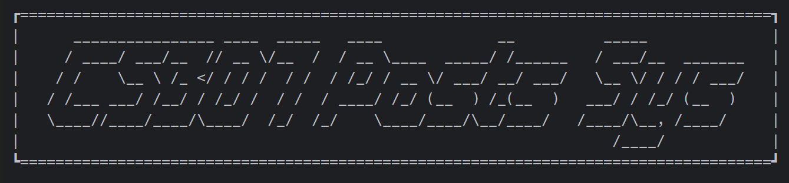
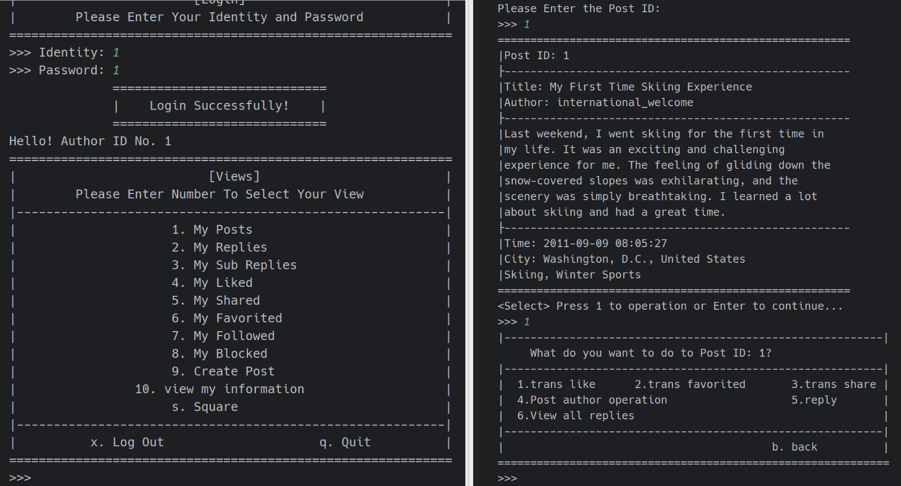
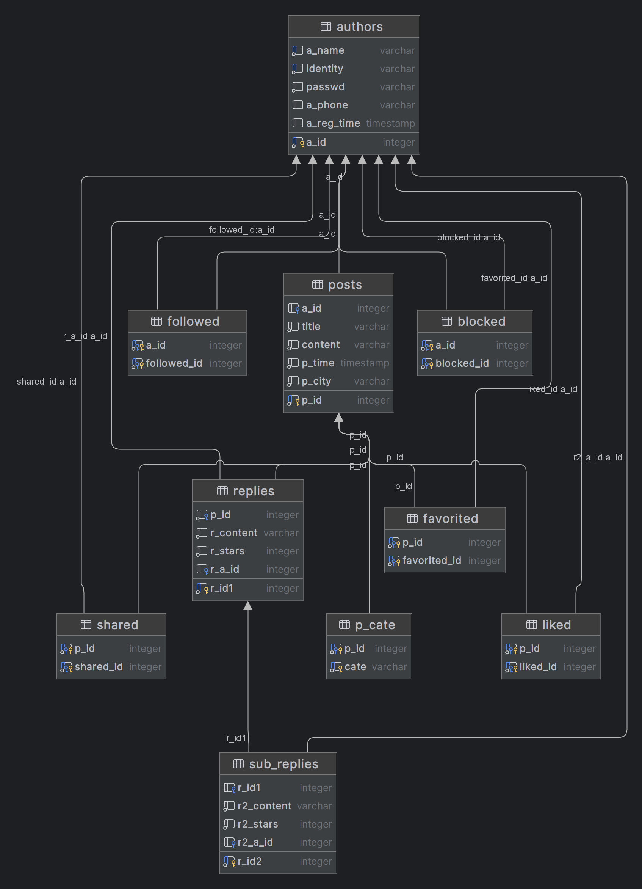

# SUSTech_CS307-DB_2023s_Projects
Our projects of CS307 2023 Spring: Database Principle, SUSTech. Taught by Prof. Yuxin MA.

With Spark + [PSQL](https://www.postgresql.org/)/ [OpenGauss](https://opengauss.org).

| Part      | Content                                                      | Grade   |
| --------- | ------------------------------------------------------------ | ------- |
| Project 1 | Database design, data import and efficiency comparison.      | 96/100  |
| Project 2 | Database interaction with front-end and back-end separation. | 102/100 |

### Project Documentation

You can check the following links for detailed information (our report is in Chinese):

[**Project 1 docs folder link**](Project1_Docs/)

[**Project 2 docs folder link**](Project2/docs/)

### Welcome to Our CS307 Post System!

#### User CLI

#### Project 2 E-R Diagram

Automatically generated by JetBrains DataGrip, for reference only.

